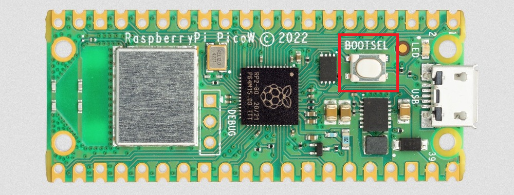
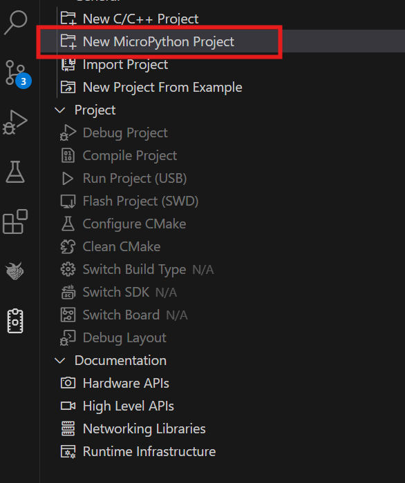
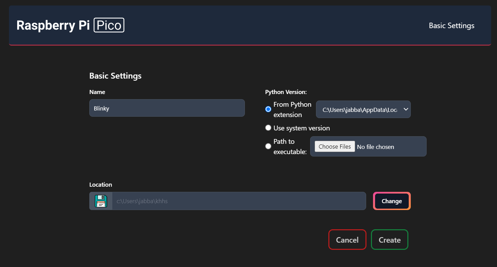
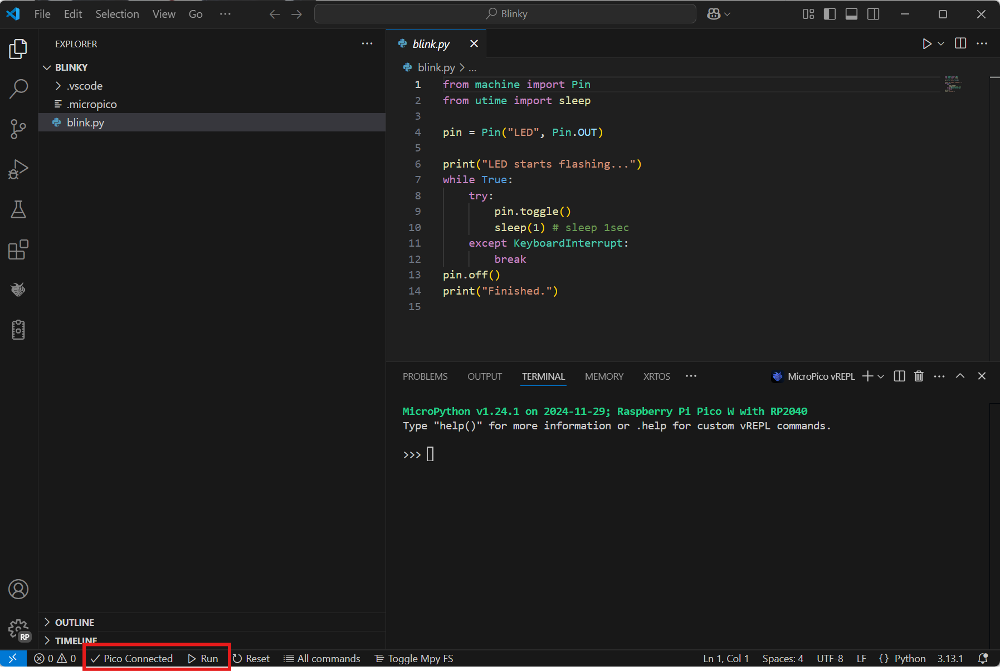

# Raspberry-Pi-Pico-BaseCode
Base code for working with the raspberry pi pico

## Getting Started
### Loading the Firmware

1. You will need to download the latest micropython version to load onto the [Raspberry Pi Pico W](https://micropython.org/download/RPI_PICO_W/). Ensure you grab the latest build and not a preview build.
2. Hold down the <kbd>BOOTSEL</kbd> button on the raspberry Pi Pico

3. Connect the Pi Pico to the USB cable connected to you laptop.
4. When the drive is displayed in Windows Explorer or Mac Finder copy the uf2 file from step 2 onto the Pi Pico drive.
5. If this was successful the drive will disappear as the device has been reset ready for use.

### Your First Program
1. Disconnect the Pi Pico from your laptop.
2. If you haven't already, use GitHub Desktop or the commandline to clone this repo to your machine.
3. Download the VSCode profile for the Pi Pico from VSCode Setup Repo, [RP Pico.code-profile](https://github.com/KillarneyHeightsHS/vscode-setup/tree/main/profiles) and import it into VSCode
4. You should now see a new icon on the left called `Raspberry Pi Pico Project` 
5. Connect the Pi Pico to your laptop
6. Click on it and select `New MicroPython Project`

7. Give your project a name `Blinky` and change the location to where you want the project to be created.

8. Click `Create` to create your new Pi Pico project
9. If everything has gone smoothly you should have a new project that looks like the below image.

10. You should see that the Pico is connected and you can click on the run icon in the bottom left position to run the code python conde in `blink.py` on the Pi Pico.

