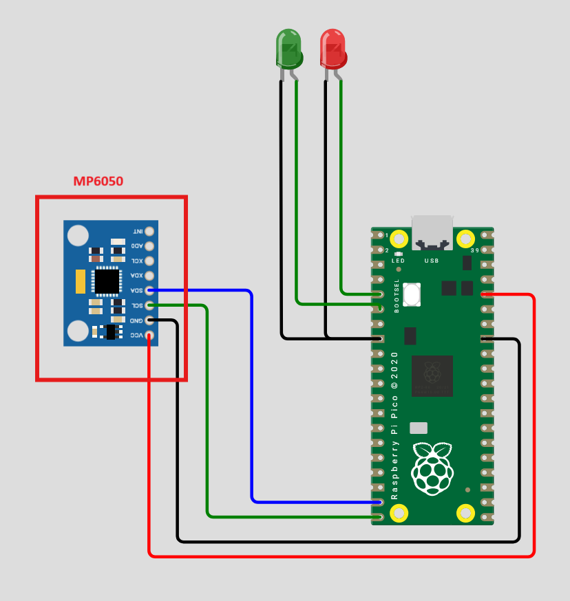

# Accelerometers

## Activity
### Building a Pitch and Movement Alarm

We will be using an MP6050 which is 6-axis Motion Tracking Device which can also be called an inertial measurement unit (IMU). It has both a gyroscope and accelerometer built into it.

1. View the Raspberry Pi Pico on [Wokwi](https://wokwi.com/projects/425583691447665665) that has been setup with an MPU6050. 

    You should see a Pi Pico connected to the MP6050 and 2 LEDs. 
    

    1. Read the code and predict what will happen when you run the simulation.

    2. Run the simulation and click on the MP6050 to alter the pitch of the device (x-rotation).
    

    3. Why do the LEDs change?
    4. Modify the code to handle y or z rotation?

2. The code below supports movement detection. When the button is pushed, it activates the accelerometer. Any slight movement after the button is pressed with trigger an alarm.

    1. Draw a flowchart that represents the flow and decisions of the code. You can choose to draw it on paper,  draw.io, lucidchart. Rememeber the symbols for a flowchart are:
    
     

     2. Update the wokwi simulation to include a button for activating the sensor. Use the code as a guide for how it should be connected.

     3. Update the code and try to run the simulator. You may need to debug your simulation if it is not working.

    ```python
    from mpu6050 import MPU6050
    from machine import Pin
    import time

    time.sleep(0.1) # Wait for USB to become ready

    # configure the pins
    errorLed = Pin(3, Pin.OUT)
    okLed = Pin(4, Pin.OUT)
    button = Pin(8, Pin.IN)

    # indicate if the alarm is armed
    alarm_armed = False

    # configure the accelerometer
    i2c = machine.I2C(1, sda=Pin(14), scl=Pin(15))
    mpu = MPU6050(i2c)

    # wake up the MPU6050 from sleep
    mpu.wake()

    def flash_led():
        # Flash the on led 4 times in 2 seocnds
        for flash_count in range(8):
            print(f'Arming the alarm {flash_count}')
            okLed.value(flash_count % 2)
            time.sleep(0.5)

    def get_strength(mpu):
        # Gets the combined acceleration measurement across all 3 axis as a +ve value in g
        accel = mpu.read_accel_data()
        return sum(abs(a) for a in accel)

    while True:
        
        # Arm the alarm 
        if button.value() == 0:
            alarm_armed = True
            print('Arming the alarm')
            flash_led()

        # Check if the alarm has been triggered
        if alarm_armed and get_strength(mpu) > 0.1:
            errorLed.high()
            okLed.low()
            print('Alarm Triggered')

        time.sleep(0.1)
    ```

    4. There is a bug in the solution. The alarm keeps re-arming. Change the code so that it is only armed once.
    5. **Extension:** Adjust the system and code to include an alarm sound that turns off after 3 seconds. 