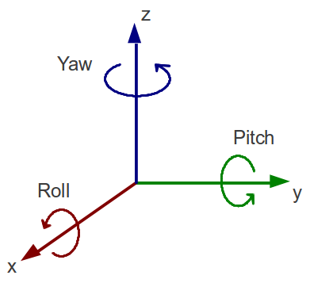
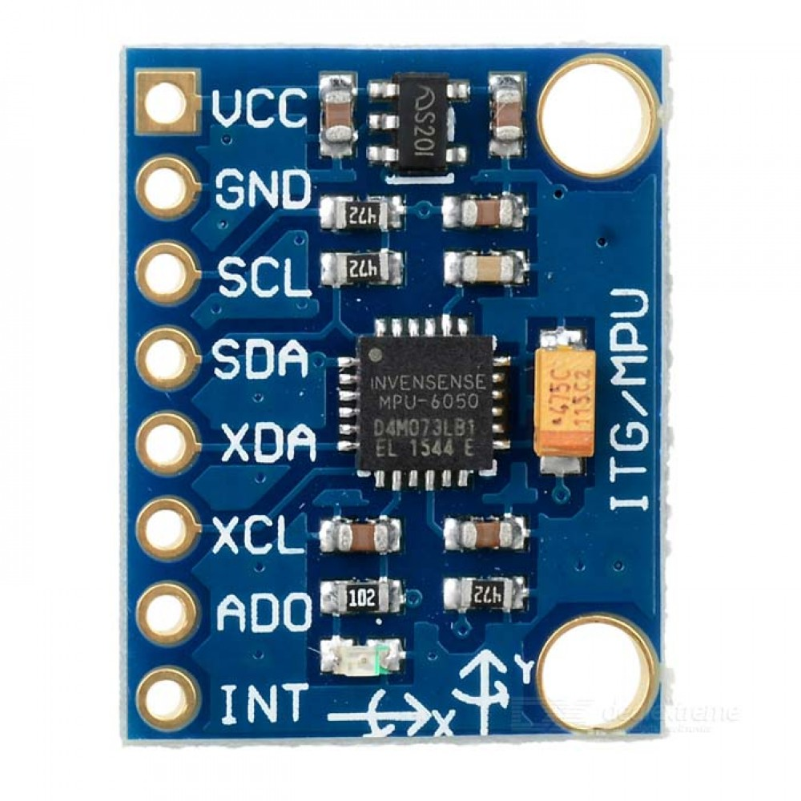

# Accelerometer & Gyroscope
These can be used together to measure both linear acceleration and angular velocity. They can be used for gimbals (think of a camera stabiliser), self balancing robots, gaming controllers, smartphones, drones, motion detection like someone falling over, VR headsets, and more.

## What is an Accelerometer?
An accelerometer is an electronic device that measures acceleration, which is defined as the rate of change of velocity with respect to time.

## What is a Gyroscope?
A gyroscope is an electronic device that measures angular velocity, which is defined as the rate of change of orientation with respect to time. 

## Pitch, Roll and Yaw
These are the three angles that describe the orientation of an object in 3D space. They are commonly used in robotics and aerospace applications. They are measured in degrees or radians. 

{ width=400px }

**Roll:**

- Roll refers to rotation about the vertical axis passing through an object's center of mass.
- It is often compared to the motion when you tilt your head from side to side.
- In aviation or aerospace, a positive roll indicates a banking action where one wing rises relative to the other.

**Yaw:**

- Yaw refers to rotation about the horizontal axis passing through an object's center of mass.
- It is similar to the motion when you turn your head from left to right.
- In aviation or aerospace, yaw indicates a change in direction of flight along the horizontal plane.

**Pitch:**

- Pitch refers to rotation about the longitudinal axis passing through an object's center of mass.
- It is often compared to the motion when you tilt your body forward or backward.
- In aviation or aerospace, pitch is the angle between the nose of the aircraft and a horizontal line.

## MP6050
The MP6050 is a popular 6-axis Motion Tracking Device which can also be called an inertial measurement unit (IMU). It has both a gyroscope and accelerometer built into it. This gives the device the ability to measure both linear acceleration and angular velocity.

It also has a built in digital temperature sensor that can be used for temperature compensation.

{ width=300px }

### Features
The MP6050 has the following features:

- **Accel Range**: ±2g, ±4g, ±8g, ±16g
- **Gyro Range**: ±250°/s, ±500°/s, ±1000°/s, ±2000°/s
- **Temperature Sensor**: Measures temperature in °C with a resolution of 0.5°C
- **I2C Interface**: Supports I2C communication at up to 400 kHz
- **SPI Interface**: Supports SPI communication at up to 10 MHz
- **Interrupt Pin**: Can generate interrupts for various events such as data ready and motion detection.

### Pinout
Here is a pinout table for the MPU-6050 sensor:

| Pin Number | Pin Name     | Description                                      |
|------------|--------------|--------------------------------------------------|
| 1          | VCC          | Power supply, typically +3.3V or +5V              |
| 2          | GND          | Ground                                           |
| 3          | SDA (SDIO)   | I2C serial data line                             |
| 4          | SCL (SCLK)   | I2C serial clock line                              |
| 5          | XDA         | Used to interface other I2C sensors with the MPU-6050 |
| 6          | XCL         | Used to interface other I2C sensors with the MPU-6050 |
| 7          | AD0         | Use this pin to change the I2C address |
| 8          | INT         |Interrupt pin – can be used to indicate that new measurement data is available |