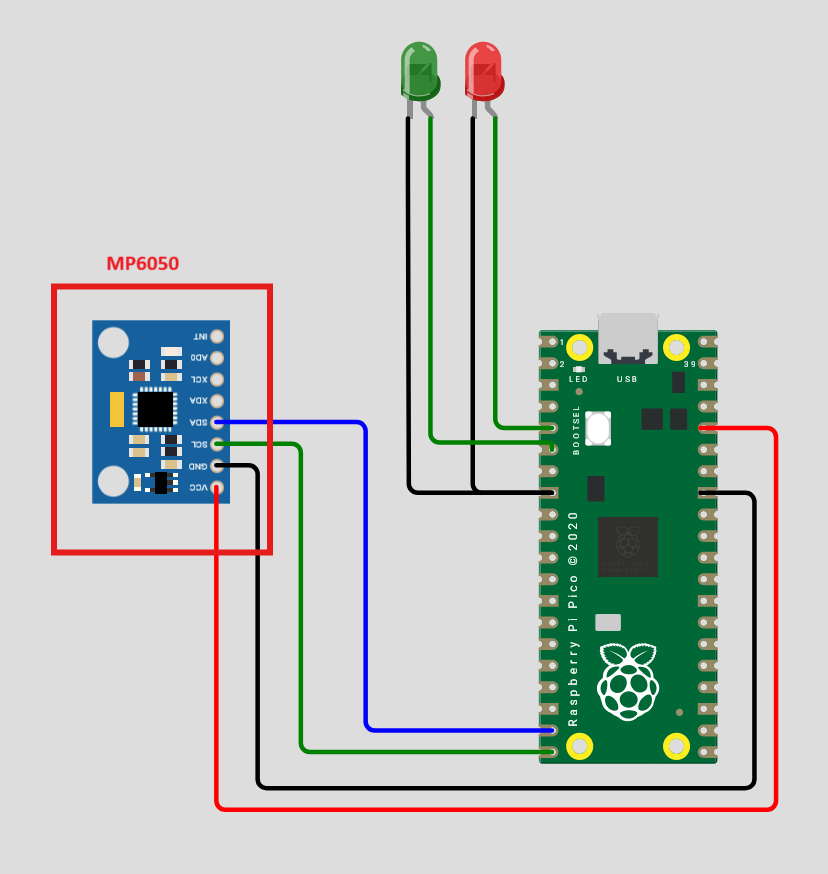
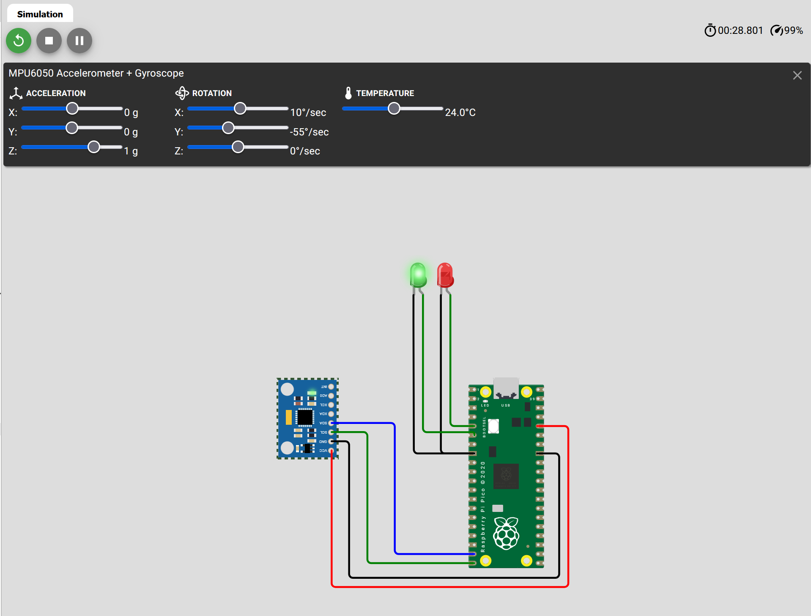

# Motion Detection

## Simulation

We will be using an MP6050 which is 6-axis Motion Tracking Device which can also be called an inertial measurement unit (IMU). It has both a gyroscope and accelerometer built into it.

View the Raspberry Pi Pico on [Wokwi](https://wokwi.com/projects/425583691447665665){ target="_blank" } that has been setup with an MPU6050. 

- You should see a Pi Pico connected to the MP6050 and 2 LEDs. 
{ width=400px }


!!! Activity
    1. Read the code and predict what will happen when you run the simulation.

    2. Run the simulation and click on the MP6050 to alter the pitch of the device (x-rotation).
    { width=600px }

    3. Why do the LEDs change?
    4. Modify the code to handle y or z rotation?
    5. The data is being displayed in the output window of Wokwi or when you run it on your device. Change the output to display as comma separated values. Take a copy of the output and paste it into a spreadsheet to analyse the data. What do you notice?
    6. Using the supplied mechatronics kit build the motion detection system. Test it out! Step by step instructions are below

## Building the Motion Detection System

### Materials
- Pi Pico x1
- MP6050 x1
- Breadboard and jumper wires
- LEDs x2
- 220 ohm resistors x2


!!! Note
    - Red wires are power
    - Black wires are ground
    - Blue and Green wires are signal

### Step 1: Pico and MPU6050

- Attach the Pi Pico and the MP6050 sensor to the terminal strip of the breadboard.
{ width=400px }

### Step 2: LED Connection

- Insert the LEDs into the breadboard. The cathode (longer leg) should be connected to a GPIO pin on the Pi Pico and the anode (shorter leg) should be connected to a resistor, which is then connected to ground.

| GPIO Pin | LED Cathode | Resistor | Ground |
|----------|-------------|----------|--------|
| 18       | Green       | 220 ohm (Ω) | GND    |
| 19       | Blue       | 220 ohm (Ω) | GND    |

{ width=400px }

!!! Note
    - The black ground wire is connected from the Pi Pico to the -ve rail of the breadboard.
    - The red power wire is connected from the Pi Pico to the +ve rail of the breadboard.

### Step 3: Power and Ground Connections

- Connect the power and ground wires for the MP6050 sensor to the breadboard. The VCC pin should be connected to a 3.3V power source, and the GND pin should be connected to ground.

| MP6050 Pin | Pi Pico Pin  |
|------------|------------------------|
| VCC        | 3.3V Power Source       |
| GND        | Ground                 |

{ width=400px }

### Step 4: I2C/Signal Connection

- Connect the I2C pins for the MP6050 sensor to the breadboard. The SCL pin should be connected to GPIO 15, and the SDA pin should be connected to GPIO 14.

| MP6050 Pin | Pi Pico Pin  | Colour |
|------------|--------------| -------- |
| SCL        | GPIO 15      |  Orange     |
| SDA        | GPIO 14      |  White        |

{ width=400px }

### Step 5: Code Implementation

1. Open VSCode and create a new Raspberry Pi Pico project.
2. Copy the file `mpu6050.py` from the [repository](){target=_blank} into your project folder.
3. Create a file called main.py and add the following code:
```python

```

### Step 6: Upload and Run the Code

1. Connect the Pi Pico to your computer via USB.
2. Click on the Toggle Virtual MicroPython Workspace button to open a new VSCode window with the MicroPython workspace.
3. Right click on the 'mpu6050.py' file and select 'Upload file to Pico'.
4. Check that the file has been uploaded by checking the 'Mpy Remote Workspace' folder
5. Select the `main.py` file and click run to run the program on the Pi Pico.


!!! Note
    - You will need to have followed the [getting started guide](../../index.md) to set up VSCode for Raspberry Pi Pico development.
 

## Debugging
### MPU Wake error
- Check that your wiring is correct and that the code Pins match your wiring.

```
>>> 
Traceback (most recent call last):
  File "<stdin>", line 14, in <module>
  File "mpu6050.py", line 30, in wake
OSError: [Errno 5] EIO

>>> 
```

### SCL or SDA error
- Check that your wiring is correct and that the code Pins match your wiring. 
- Check that you are using compatible I2C pins on the Pi Pico.

```
>>> 
Traceback (most recent call last):
  File "<stdin>", line 10, in <module>
ValueError: bad SCL pin

>>> 
```
