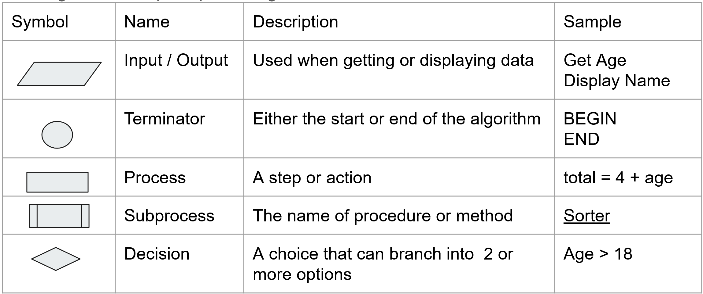

1. The code below supports movement detection. When the button is pushed, it activates the accelerometer. Any slight movement after the button is pressed with trigger an alarm.

    1. Draw a flowchart that represents the flow and decisions of the code. You can choose to draw it on paper, [draw.io](https://app.diagrams.net/), [lucidchart](https://www.lucidchart.com). Remember the symbols for a flowchart are:
     
    2. Update the Wokwi simulation to include a button for activating the sensor. Use the code as a guide for how it should be connected.
    3. Update the code and try to run the simulator. You may need to debug your simulation if it is not working.

    ```python
    from mpu6050 import MPU6050
    from machine import Pin
    import time

    time.sleep(0.1) # Wait for USB to become ready

    # configure the pins
    errorLed = Pin(3, Pin.OUT)
    okLed = Pin(4, Pin.OUT)
    button = Pin(8, Pin.IN)

    # indicate if the alarm is armed
    alarm_armed = False

    # configure the accelerometer
    i2c = machine.I2C(1, sda=Pin(14), scl=Pin(15))
    mpu = MPU6050(i2c)

    # wake up the MPU6050 from sleep
    mpu.wake()

    def flash_led():
        # Flash the on led 4 times in 2 seocnds
        for flash_count in range(8):
            print(f'Arming the alarm {flash_count}')
            okLed.value(flash_count % 2)
            time.sleep(0.5)

    def get_strength(mpu):
        # Gets the combined acceleration measurement across all 3 axis as a +ve value in g
        accel = mpu.read_accel_data()
        return sum(abs(a) for a in accel)

    while True:
        
        # Arm the alarm 
        if button.value() == 0:
            alarm_armed = True
            print('Arming the alarm')
            flash_led()

        # Check if the alarm has been triggered
        if alarm_armed and get_strength(mpu) > 0.1:
            errorLed.high()
            okLed.low()
            print('Alarm Triggered')

        time.sleep(0.1)
    ```

    4. There is a bug in the solution. The alarm keeps re-arming. Change the code so that it is only armed once.
    5. **Extension:** Adjust the system and code to include an alarm sound that turns off after 3 seconds. 