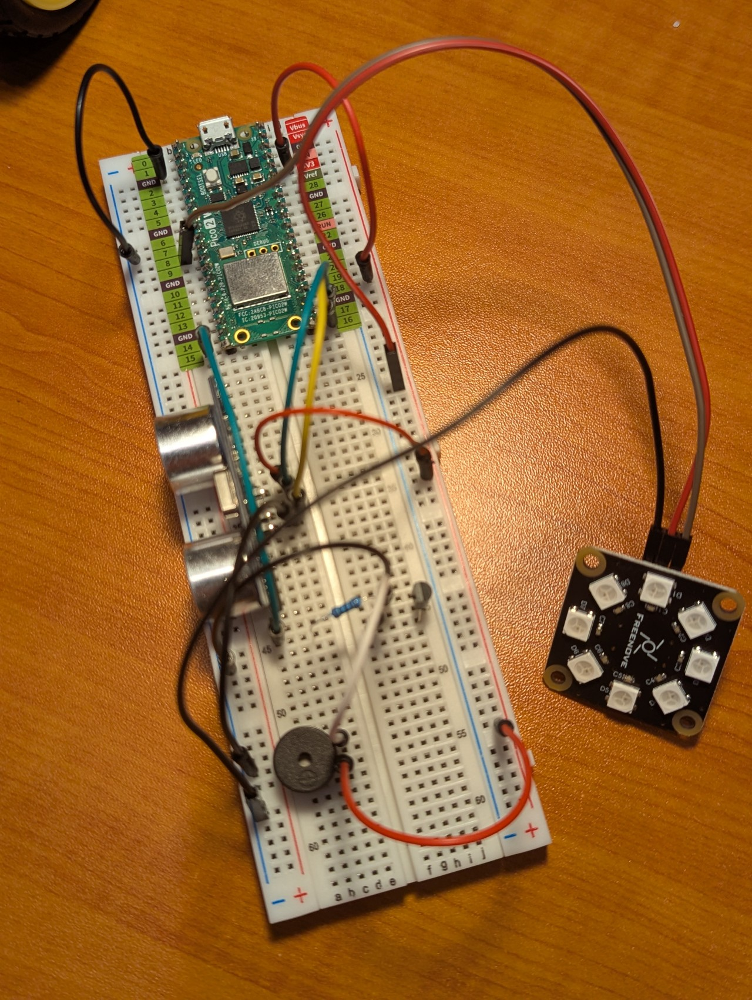
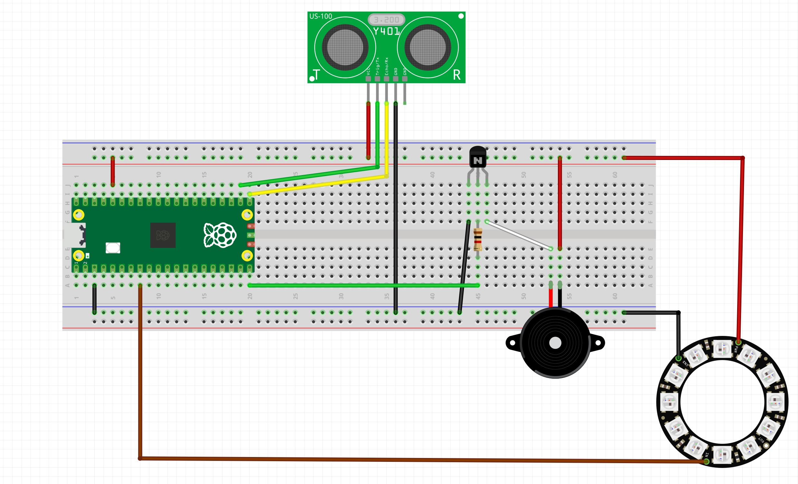

# Parking Sensor

You have been approached to develop a parking sensor system for a car. The system should be able to detect when the car is too close to another object and provide an alert to the driver. The system should also be able to measure the distance between the car and the object. You should display varying levels of alerts based on the distance, such as "Red" for 10cm, "Orange" for 20cm, "Yellow" for 30cm, "Green" for 40cm, and "Blue" for 50cm. The system could also display the distance in centimetres on a digital display.

{ width=400}

## Steps to Implement
This system is more complex than those done previously. We will build the system in stages and test each stage before moving on to the next. We will start by setting up the ultrasonic sensor and reading distance data from it.

# Wiring Schematic

{ width=400}


### Step 1: Components
- [Ultrasonic Sensor](../index.md#ultrasonic-sensors) (SR04)
- 8 LED RGB Module
- 1k Ohm [Resistor](../../electronics/index.md#resistors) x 1
- Passive Buzzer x 1
- NPN Transistor x 1 (S8050)
- Breadboard and Jumper Wires
- Raspberry Pi Pico

### Step 2: Setup the Ultrasonic Sensor
Connect the ultrasonic sensor to the Raspberry Pi Pico according to the wiring diagram. Make sure to connect the VCC and GND pins of the sensor to a 3.3V power source on the Raspberry Pi Pico.

| Ultrasonic Sensor | Raspberry Pi Pico | Colour |
|------------------|-------------------| ---|
| VCC              | 3.3V              | Red |
| GND              | GND               | Black |
| Trig             | GP17              | Green |
| Echo             | GP16              | Yellow |

```python
# Import necessary libraries
import time
from machine import Pin

# Define pins for ultrasonic sensor
trig = Pin(17, Pin.OUT)
echo = Pin(16, Pin.IN)

# Function to measure distance
def measure_distance():
    trig.value(0)
    time.sleep_us(2)
    trig.value(1)
    time.sleep_us(10)
    trig.value(0)
    while echo.value() == 0:
        pulse_start = time.ticks_us()
    while echo.value() == 1:
        pulse_end = time.ticks_us()
    pulse_duration = time.ticks_diff(pulse_end, pulse_start)
    distance = pulse_duration * 0.0343 / 2
    return distance

# Main loop
while True:
    distance = measure_distance()
    print("Distance:", distance, "cm")
    time.sleep(1)
```

- Test it out by running it on your Raspberry Pi Pico and checking the output in the serial monitor. Try waving your hand and other materials in front of the sensor to see how it measures their distance. 

!!! Question
    - Was there any material that was difficult to measure? Why do you think that is?
    - Why do you think we need the sleeps in the `measure_distance()` function?


### Step 3: Setup the RGB LED Module
Connect the RGB LED module to the Raspberry Pi Pico according to the wiring diagram. Make sure to connect the VCC and GND pins of the module to a 3.3V power source on the Raspberry Pi Pico.

| RGB LED Module | Raspberry Pi Pico | Colour |
|----------------|-------------------| ---|
| VCC              | 3.3V              | Red |
| GND              | GND               | Black |
| S                | GP21              | Brown |


```python
# Import necessary libraries
import time
from machine import Pin
import neopixel

# Define pins for ultrasonic sensor
trig = Pin(17, Pin.OUT)
echo = Pin(16, Pin.IN)

# Define pin for LEDs
pixel = neopixel.NeoPixel(Pin(8, Pin.OUT), 8)

# Function to set the colour of the pixel ring
def set_pixel_colour(colour):
    print(f'set colour: {colour}')
    if colour == 'Red': 
        pixel.fill((64, 0, 0))
    elif colour == 'Yellow': 
        pixel.fill((64, 64, 0))
    else: 
        pixel.fill((0, 64, 0))
    pixel.write()

# Function to measure distance
def measure_distance():
    trig.value(0)
    time.sleep_us(2)
    trig.value(1)
    time.sleep_us(10)
    trig.value(0)
    while echo.value() == 0:
        pulse_start = time.ticks_us()
    while echo.value() == 1:
        pulse_end = time.ticks_us()
    pulse_duration = time.ticks_diff(pulse_end, pulse_start)
    distance = pulse_duration * 0.0343 / 2
    return distance

# Main loop
while True:
    distance = measure_distance()
    print("Distance:", distance, "cm")
    time.sleep_ms(500)

    if distance < 5:
        pixel.write()
        set_pixel_colour('Red')
    elif distance < 20:
        set_pixel_colour('Yellow')
    else:
        set_pixel_colour('Green')
```

!!! Question
    - Try changing the distance thresholds to see how it affects the LED colour changes.
    - Experiment with different colours for the LED ring.


### Step 4: Setup the LCD Display (Optional)
Connect the LCD display to the Raspberry Pi Pico according to the wiring diagram. Make sure to connect the VCC and GND pins of the module to a 3.3V power source on the Raspberry Pi Pico.

| LCD Display | Raspberry Pi Pico | Colour |
|-------------|-------------------| ---|
| VCC         | 3.3V              | Red |
| GND         | GND               | Black |
| SDA         | GP14              | Brown |
| SCL         | GP15              | Orange |

```python
# Import necessary libraries
import time
import math
from machine import Pin, PWM
import neopixel

# Define pins for ultrasonic sensor
trig = Pin(17, Pin.OUT)
echo = Pin(16, Pin.IN)

# Define pin for LEDs
pixel = neopixel.NeoPixel(Pin(8, Pin.OUT), 8)

# Define pin for buzzer
passiveBuzzer = PWM(Pin(15, Pin.OUT))
passiveBuzzer.freq(1000)
PI = 3.14

# Function to set the colour of the pixel ring
def set_pixel_colour(colour):
    print(f'set colour: {colour}')
    if colour == 'Red': 
        pixel.fill((64, 0, 0))
    elif colour == 'Yellow': 
        pixel.fill((64, 64, 0))
    else: 
        pixel.fill((0, 64, 0))
    pixel.write()

# Function to measure distance
def measure_distance():
    trig.value(0)
    time.sleep_us(2)
    trig.value(1)
    time.sleep_us(10)
    trig.value(0)
    while echo.value() == 0:
        pulse_start = time.ticks_us()
    while echo.value() == 1:
        pulse_end = time.ticks_us()
    pulse_duration = time.ticks_diff(pulse_end, pulse_start)
    distance = pulse_duration * 0.0343 / 2
    return distance

def sound_distance():
    print('Make sound')
    passiveBuzzer.duty_u16(2*4092)
    for x in range(0, 36):
        sinVal = math.sin(x * 10 * PI / 180)
        toneVal = 1500 + int(sinVal * 500)
        passiveBuzzer.freq(toneVal)
        time.sleep_ms(10)

# Main loop
while True:
    distance = measure_distance()
    print("Distance:", distance, "cm")
    time.sleep_ms(500)

    if distance < 5:
        pixel.write()
        set_pixel_colour('Red')
        sound_distance()
    elif distance < 20:
        set_pixel_colour('Yellow')
        passiveBuzzer.duty_u16(0)
    else:
        set_pixel_colour('Green')
        passiveBuzzer.duty_u16(0)
```

!!! Question
    - Can you make the sound more like what you hear when a car is reversing. That is the sound should happen more quickly and not sound like an alarm?