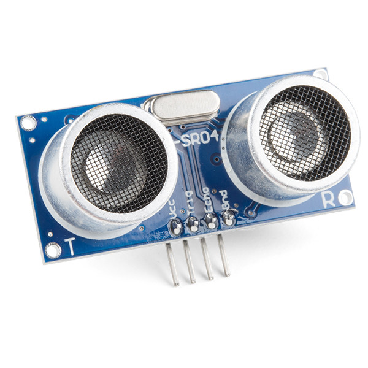
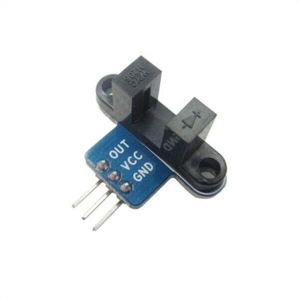
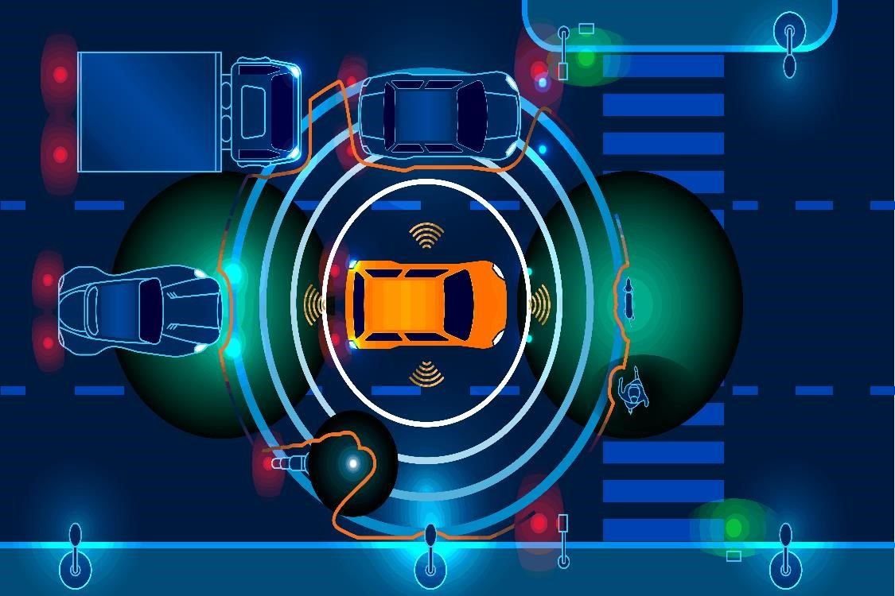

# Distance Sensors

Distance sensors are used to measure the distance between an object and a sensor. They are commonly used in robotics for navigation, obstacle avoidance, liquid levels, distance between the earth and the moon, objects crossing a threshold like a door way and even in air quality monitoring.
Distance sensors come in many shapes and sizes, but most of them have a similar basic principle. They emit a signal and measure the time it takes for that signal to bounce back after hitting an object. This time is then converted into distance using a formula based on the speed of sound or light.

There are many types of distance sensors available, including radar, ultrasonic sensors, infrared sensors, and LiDAR sensors. 

## Ultrasonic Sensors

Ultrasonic sensors use sound waves to measure distance. They emit a high-frequency sound wave and listen for the echo that bounces back from an object. The time it takes for the sound wave to travel to the object and back is used to calculate the distance. Ultrasonic sensors are commonly used in robotics because they are accurate, reliable, and easy to use. However, they can be affected by obstacles and reflections along with soft or angled surfaces.

In our mechatronic kits we have an SR04 ultrasonic sensor which can be used to measure distances up to 2 meters with an accuracy of about 3mm. It has two pins, Trigger and Echo pins. The Trigger pin is used to send out a pulse, while the Echo pin is used to receive the echo.

The formula to calculate the distance using SR04 ultrasonic sensor is:

$$ \text{Distance} = \frac{\text{Time} \times \text{Speed of Sound}}{2} $$

Where, Time is the time it takes for the sound wave to travel to the object and back, Speed of Sound is approximately 343 m/s at room temperature.

{ width=400 }

## Infrared Sensors
Infrared sensors use infrared light to measure distance. They emit a beam of infrared light and listen for the reflection that bounces back from an object. The amount of reflected light is used to calculate the distance. Infrared sensors are commonly used in robotics for obstacle avoidance and more.

We can use IR sensors to measure speed. By connecting two IR sensors on either side of a wheel, we can measure the time it takes for the wheel to rotate. By knowing the circumference of the wheel, we can calculate the speed of the robot.

{ width=400 }

## LiDAR Sensors
LiDAR sensors use laser light to measure distance. They emit a beam of laser light and listen for the reflection that bounces back from an object. The amount of reflected light is used to calculate the distance.
LiDAR sensors are commonly used in robotics for mapping and many of self driving applications. However, they can be affected by obstacles and reflections, along with weather conditions.

{ width=400 }

## Radar Sensors
Radar sensors use radio waves to measure distance. They emit a beam of radio waves and listen for the reflection that bounces back from an object. The amount of reflected radio waves is used to calculate the distance. Radar sensors are commonly used in aviation, automotive and military applications. Radars were first developed during World War II and are anecdotally the reason why carrots are said to be good for your eyesight. This arose from propaganda efforts by the allies during WWII.

