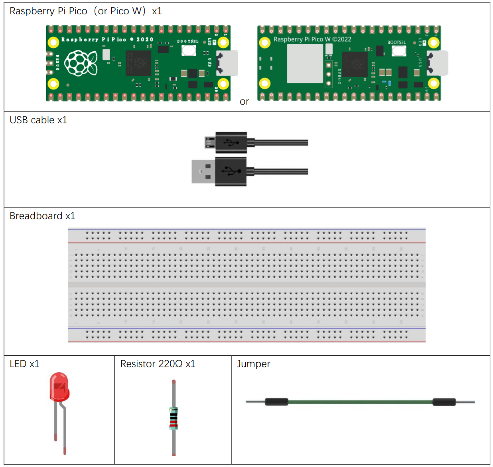
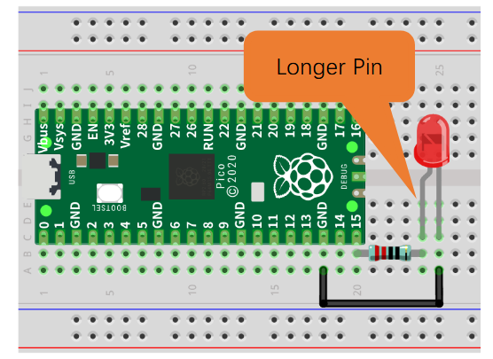

# Blinking LED

## Introduction
The blinking LED is a classic example used to demonstrate the basic functionality of microcontrollers. It involves toggling an LED on and off repeatedly, which can be achieved using simple programming logic.

## Components
- Raspberry Pi Pico W
- Breadboard
- Jumper wires
- Red LED
- 220 ohm resistor
- USB Cable




## Onboard LED
The Raspberry Pi Pico W has an onboard LED connected to GPIO 25. This LED can be used for basic testing and debugging purposes.

1. Connect the Pico W to your computer using a USB cable.
2. Open VS Code and start a new Pico Project
3. In the main.py file, add the code

```python
from machine import Pin
import time

led = Pin('LED', Pin.OUT)
try:
while True:
    led.value(1)
    time.sleep(0.5)
    led.value(0)
    time.sleep(0.5)
except:
    pass
```

4. Run the code on your Pico W by clicking the "Run" button in VS Code at the bottom of the IDE.
5. Upload the code to your Pico W and observe the onboard LED blinking.


- Try making the LED blink faster or slower by changing the sleep duration.

## External LED



```python
from machine import Pin
import time

led = Pin(15, Pin.OUT)
try:
while True:
    led.value(1)
    time.sleep(0.5)
    led.value(0)
    time.sleep(0.5)
except:
    pass
```

- Try connecting more and or different coloured LEDs
- See of you can create a chaser sequence with multiple LEDs.
    - A chaser is when one LED turns on, then the next, then the next until all are lit up in sequence before starting again.

