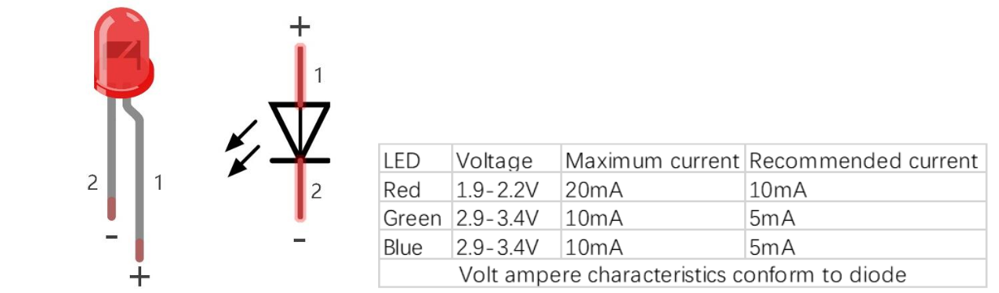

# Light Emitting Diode (LED)

An LED is a type of diode. All diodes only work if current is flowing in the correct direction and have two Poles. 

An LED will only work (light up) if the longer pin (+) of LED is connected to the positive output from a power source and the shorter pin is connected to the negative (-). Negative output is also referred to as Ground (GND). This type of component is known as “Polar” (think One-Way Street).

All common two-lead diodes are the same in this respect. Diodes work only if the voltage of its positive electrode is higher than that of its negative electrode, and there is a narrow range of operating voltages for most common diodes, typically between 1.9V and 3.4V. If you use much more than 3.3V the LED will be damaged and burn out

