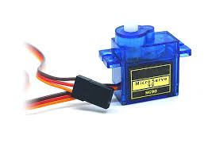
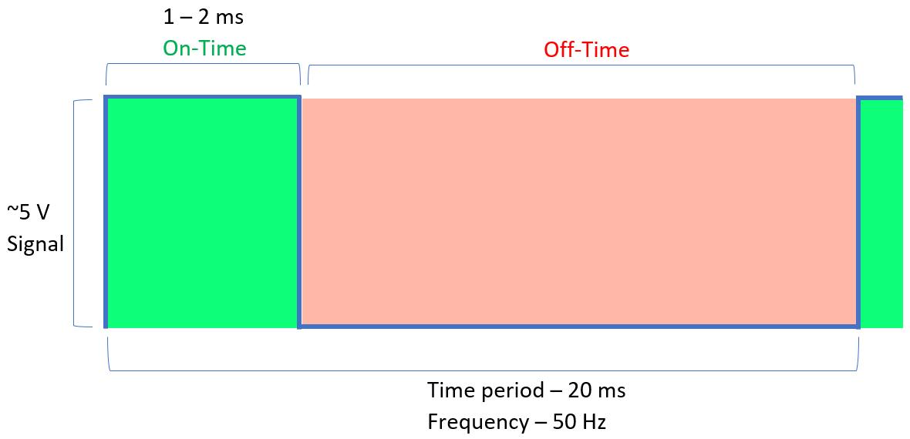
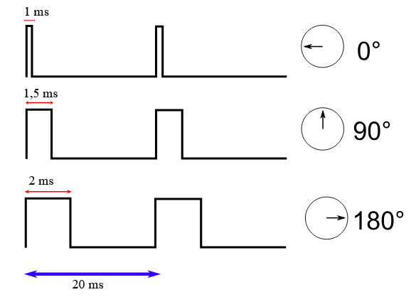

# Servo Motors

## 1. Introduction to Pulse Width Modulation (PWM)

Pulse Width Modulation (PWM) is a technique used to encode information or control the amount of power delivered to a device by varying the width of pulses in a periodic signal. In simpler terms, PWM rapidly switches a digital signal between on (HIGH) and off (LOW) states at a specific frequency, with the ratio of "on time" to "total time" (known as duty cycle) determining the average power delivered.



### Key PWM Concepts:

- **Period**: The time it takes for one complete cycle (measured in seconds or milliseconds)
- **Frequency**: The number of complete cycles per second (measured in Hertz, Hz)
- **Duty Cycle**: The percentage of time the signal is HIGH during one period
- **Pulse Width**: The duration of the HIGH state (measured in microseconds for servos)



### Uses of PWM in Electronics:

PWM is used in micro-controller boards because they can only produce digital (on or off) voltage pulses rather than continuous analog voltage. PWM effectively simulates an analog output by switching rapidly between on and off states.

Common uses of PWM include:

- Controlling motor speed (DC motors)
- Controlling servo position (standard 180° servos)
- Controlling servo speed and direction (continuous rotation servos)
- LED brightness control
- Audio generation
- Power regulation

PWM is a clever solution that allows digital systems to control analog devices by using the duration (width) of digital pulses rather than varying the voltage directly.

## 2. Types of Servo Motors

There are two main types of servo motors commonly used in electronics and robotics projects: standard 180° servos and continuous rotation servos. Each has distinct characteristics and applications.

### 2.1 Standard 180° Servo Motors

Standard 180° servo motors are designed to rotate to specific angular positions within a 180-degree range. These are the most common type of servos used in hobbyist electronics, robotics, and RC applications.

#### Key Characteristics:
- Limited rotational range (typically 0° to 180°)
- Precise positional control
- Ability to hold a specific angle against opposing forces
- Built-in position feedback (via potentiometer)

#### Components of a 180° Servo Motor:
- DC motor (provides the rotational power)
- Gearbox (for torque amplification and speed reduction)
- Potentiometer (for position feedback)
- Control circuit (interprets PWM signals)

A servo motor has a 'closed-loop' control system that uses feedback to control its position. The potentiometer is attached to the output axle and as the axle turns, it changes the voltage delivered to the control circuit. This voltage is proportional to the rotation of the gear and can be measured against the voltage originally sent to the servo, causing the motor to rotate until the two match.

### 2.2 Continuous Rotation Servos

Unlike standard servos, continuous rotation servos are modified to allow complete 360° rotation. They're essentially a hybrid between a standard servo and a geared DC motor.

#### Key Characteristics:
- Unlimited rotation in either direction
- Speed and direction control (rather than position control)
- Usually no position feedback
- Same form factor and control interface as standard servos

#### How Continuous Rotation Servos Differ:
- The potentiometer is either removed or fixed in the center position
- The mechanical stops are removed to allow full rotation
- PWM signals control speed and direction rather than position
- 1.5ms pulse (neutral) stops the servo
- <1.5ms pulses rotate in one direction (faster as pulse width decreases)
- \>1.5ms pulses rotate in the other direction (faster as pulse width increases)

## 3. How Servos Interpret PWM Signals

### 3.1 PWM Control for 180° Servos

Standard 180° servos use PWM signals to determine their position. The width of the pulse tells the servo where to position its shaft:

- **1.0ms pulse width (1000μs)**: Moves to 0° position
- **1.5ms pulse width (1500μs)**: Moves to 90° position (center)
- **2.0ms pulse width (2000μs)**: Moves to 180° position

Most servos expect these pulses to be sent at a frequency of 50Hz, which means a period of 20ms ($1 second ÷ 50 = 0.02 seconds$ or 20ms).



### 3.2 PWM Control for Continuous Rotation Servos

For continuous rotation servos, the PWM signal controls speed and direction rather than position:

- **1.5ms pulse width (1500μs)**: No rotation (stop)
- **< 1.5ms pulse width**: Clockwise rotation (shorter pulse = faster rotation)
- **> 1.5ms pulse width**: Counter-clockwise rotation (longer pulse = faster rotation)

At the extremes:

- **1.0ms pulse width**: Maximum speed in clockwise direction
- **2.0ms pulse width**: Maximum speed in counter-clockwise direction

The control principle is similar to standard servos, but the interpretation of the signal is different. Instead of moving to a position, the continuous rotation servo will rotate at a speed proportional to how far the pulse width is from the neutral 1.5ms point.

## 3. PWM Calculations and Duty Cycle

To control a servo using PWM, we need to understand how to calculate the appropriate duty cycle:

### Formula:
```
Duty Cycle (%) = (Pulse Width / Period) × 100%
```

For a servo with a 50Hz signal (20ms period):

- 1ms pulse = (1ms / 20ms) × 100% = 5% duty cycle (0° position)
- 1.5ms pulse = (1.5ms / 20ms) × 100% = 7.5% duty cycle (90° position)
- 2ms pulse = (2ms / 20ms) × 100% = 10% duty cycle (180° position)

The width of the pulse is called its "duty cycle" (expressed as a percentage). This determines the rotational position of the servo shaft. The duty cycle represents the ratio of "on time" to "total time" in each PWM cycle.

Microcontroller boards (like the Raspberry Pi Pico or micro:bit) use PWM to control servos because they can only produce digital (on or off) voltage pulses rather than continuous analog voltage. While regular DC motors work well with continuous voltage, servos need precisely timed pulses to determine their position.

## 4. Controlling Servos with Raspberry Pi Pico

### 4.1 Controlling a Standard 180° Servo

The Raspberry Pi Pico has dedicated hardware PWM channels that can be used to control servos with high precision.

#### MicroPython Implementation:

```python
from machine import Pin, PWM
import time

# Create a PWM object on GPIO pin 0
servo = PWM(Pin(0))

# Set the PWM frequency to 50Hz (standard for servos)
servo.freq(50)

# Function to set the servo angle (0-180 degrees)
def set_angle(angle):
    # Convert angle to duty cycle (0.5ms to 2.5ms)
    # Maps angle 0-180 to duty values 1638-8192
    # 16-bit resolution means max duty value is 65535
    duty = int(1638 + (angle / 180) * 6554)
    servo.duty_u16(duty)
    
# Move servo to different positions
set_angle(0)    # 0 degrees
time.sleep(1)
set_angle(90)   # 90 degrees
time.sleep(1)
set_angle(180)  # 180 degrees
time.sleep(1)

# Center position
set_angle(90)
```

### 4.2 Controlling a Continuous Rotation Servo

For continuous rotation servos, we control speed and direction rather than position:

```python
from machine import Pin, PWM
import time

# Create a PWM object on GPIO pin 0
cont_servo = PWM(Pin(0))

# Set the PWM frequency to 50Hz (standard for servos)
cont_servo.freq(50)

# Function to set the continuous servo speed (-100 to +100)
# -100 = maximum speed in one direction
# 0 = stop
# +100 = maximum speed in the other direction
def set_speed(speed):
    # Convert speed (-100 to +100) to duty cycle
    # 1.5ms (center/stop) is approximately 4915 in 16-bit duty
    # We'll vary by about +/- 1638 from this center point
    center_duty = 4915
    duty = int(center_duty + (speed / 100) * 1638)
    cont_servo.duty_u16(duty)
    
# Example usage
set_speed(0)      # Stop
time.sleep(2)
set_speed(50)     # Half speed in one direction
time.sleep(2)
set_speed(0)      # Stop
time.sleep(1)
set_speed(-75)    # 75% speed in the other direction
time.sleep(2)
set_speed(0)      # Stop
```

### Understanding the Duty Value Calculation:

The Raspberry Pi Pico PWM has a 16-bit resolution, meaning duty cycles range from 0 to 65535.

For a 50Hz signal with a period of 20ms:

- 1ms pulse (0° for standard servo or max speed in one direction for continuous) corresponds to: (1ms / 20ms) × 65535 ≈ 3277
- 1.5ms pulse (90° or stop) corresponds to: (1.5ms / 20ms) × 65535 ≈ 4915
- 2ms pulse (180° or max speed in other direction) corresponds to: (2ms / 20ms) × 65535 ≈ 6554

In practice, you may need to adjust these values slightly depending on your specific servo.

## 5. Common Issues and Troubleshooting

### Servo Jitter
- **Cause**: Inconsistent PWM signal or noise
- **Solution**: Add a capacitor (100-470μF) across the servo's power connections

### Limited Range
- **Cause**: Incorrect pulse width range
- **Solution**: Adjust min/max pulse width values in your code

### Power Issues
- **Cause**: Insufficient current supply
- **Solution**: Use a separate power supply for servos, especially when using multiple servos

### Servo Stutter or Trembling
Hobby servos sometimes 'tremble' or 'stutter' if they do not have sufficient voltage. This happens because the control circuit is constantly trying to match the feedback from the potentiometer with the desired position. If the power supply is insufficient, the motor may not have enough torque to hold the position steadily.

### Limited Motion
Most hobby servos are typically limited to 180 degrees of motion, although some servos are capable of 360-degree rotation. This limitation is due to the mechanical constraints of the feedback potentiometer.

## 6. Practical Applications

### 6.1 Applications of 180° Servos

Standard 180° servo motors are used in a wide range of mechatronic applications:

- **Robotics**: Joint control, gripper mechanisms, robotic arms
- **Camera Systems**: Pan/tilt mechanisms, focus control, gimbal stabilisation
- **RC Vehicles**: Steering, throttle control
- **Automated Systems**: Valve control, switches
- **Accessibility Solutions**: Automatic door openers (as shown in the Skill Builder project)
- **Drone Technology**: Keeping cameras level and stabilised
- **Smart Home Automation**: Window and door openers, climate control actuators
- **Precision Equipment**: Position control for various mechanical systems

#### Example Application: Accessible Automatic Door

A practical application using an ultrasonic distance sensor and a 180° servo motor to create an accessible automatic door:

1. When a person or object gets closer than 10 centimetres from the sensor, the door opens (servo rotates to specific position)
2. When the distance is greater than 10 centimetres, the door closes (servo returns to original position)
3. This simple but effective system could assist people with mobility challenges

### 6.2 Applications of Continuous Rotation Servos

Continuous rotation servos are ideal for applications requiring controlled rotational motion rather than specific positioning:

- **Wheeled Robots**: Drive wheels for small robots where controlled speed is important
- **Conveyor Systems**: Small-scale conveyor belts with variable speed control
- **Rotating Platforms**: Turntables, rotating displays, or scanning platforms
- **Winch Mechanisms**: For pulling or lifting with controlled speed
- **Mixing Applications**: Controlled stirring or mixing in maker projects
- **Motorised Camera Sliders**: Creating smooth panning motion for timelapse photography
- **Fan or Propeller Control**: Where variable speed is needed

#### Example Application: Line-Following Robot

A line-following robot can use continuous rotation servos for its wheels:

1. When the robot needs to follow a straight line, both continuous servos rotate at the same speed
2. When the robot needs to turn, the speeds of the servos are adjusted relative to each other
3. The PWM signal can precisely control the speed of each wheel, allowing for smooth navigation

!!! Note
    DC Motors are a better choice for driving line-following robots due to their ability to provide more torque and better speed control. 

## 7. Comparing Servo Types and Other Motors

### 7.1 Standard 180° Servos vs. Continuous Rotation Servos

| Feature | 180° Servo | Continuous Rotation Servo |
|---------|------------|----------------------------|
| Rotation Range | Limited (0-180°) | Unlimited (360° continuous) |
| Control Parameter | Position | Speed and direction |
| Feedback | Position feedback via potentiometer | Typically no position feedback |
| Holding Position | Can hold a specific angle | Cannot hold position (only stop) |
| Applications | Precise positioning, RC control | Wheeled robots, continuous motion |
| PWM Control | Pulse width determines angle | Pulse width determines speed & direction |
| Common Use Case | Moving to specific angles | Continuous rotation at controlled speeds |

### 7.2 Servo Motors vs. DC Motors vs. Stepper Motors

These three types of motors are used differently in mechatronics:

**DC Motors:**
- Provide smooth, continuous rotational motion in clockwise and counterclockwise directions
- Open-loop system (input current is not affected by output rotation)
- Used in most battery-powered moving toys
- Constructed with many windings of copper wire around a rotor

**Standard Servo Motors:**
- Provide continuous angular movement to a specific location, often 0 to 180 degrees
- Use closed-loop control with feedback and high torque at low speeds
- Lower power needed compared to stepper motors
- The output shaft is linked through a potentiometer for position feedback
- Common in focusing for cameras, window and door openers, robotic arms, and RC vehicles

**Continuous Rotation Servos:**
- Hybrid between standard servos and geared DC motors
- Same form factor and control interface as standard servos
- Provides continuous rotation with speed control
- Often used in robotic wheels, conveyor systems, and other continuous motion applications

**Stepper Motors:**
- Provide precise stepped angular movement using feedback control
- High torque at high speeds
- Higher power needed
- Used in automated systems requiring precise movements (like 3D printers)
- The shaft can be commanded to move and hold at specific step positions without feedback

## 8. Wiring Diagram for Raspberry Pi Pico and SG90 Servo

| Raspberry Pi Pico |   SG90 Servo |
| ------------------|---------------|
| VBUS (5V)        | Red wire (Power) |
| GND              | Brown wire (Ground) |
| GPIO 0           | Orange wire (Signal) |


## 9. Control Systems with Servos

Servos are especially valuable in control systems, particularly in closed-loop control systems. In a closed-loop system, feedback is used to adjust the output dynamically.

### Open-Loop vs. Closed-Loop Control

**Open-Loop Systems:**

- Do not use feedback
- Example: A regular DC motor where input current is not affected by its output rotation
- Simpler but less precise

**Closed-Loop Systems:**

- Use feedback to continuously adjust the output
- Example: A servo motor where the output shaft is linked through a potentiometer
- More complex but provide precise positioning

### Practical Application: Self-Levelling Platform

A practical application where a servo and accelerometer sensor create a self-levelling platform:

- The accelerometer measures the tilt of a platform
- The servo rotates in the opposite direction to maintain a level position
- This creates a stabilising gimbal effect, similar to those used for camera stabilisation

## 10. Summary

PWM is a powerful technique for controlling servo motors by varying pulse widths to specify precise angular positions. For a standard 180° servo:

- Frequency: 50Hz (20ms period)
- Pulse width: 1.0ms to 2.0ms (corresponds to 0° to 180°)
- Duty cycle: Approximately 5% to 10% for full range

With the Raspberry Pi Pico's built-in PWM capabilities, controlling servos becomes straightforward through MicroPython's PWM library, allowing for precise positioning in a variety of applications.

Servos are a key component in mechatronic systems where precise position control is required. Unlike regular DC motors, they incorporate feedback mechanisms that allow them to maintain a specific position, making them ideal for applications ranging from robotic arms to automated doors and precision control systems.

## 11. Conclusion

PWM is a powerful technique for controlling both standard 180° servo motors and continuous rotation servos. Understanding the differences between these servo types is essential for selecting the right motor for your application:

- **Standard 180° servos** excel at precise positioning tasks where you need to move to and hold specific angles. Their built-in feedback mechanism makes them ideal for robotic arms, camera systems, and other applications requiring positional accuracy.

- **Continuous rotation servos** are perfect for applications requiring continuous motion with speed control. They're essentially a hybrid between a standard servo and a geared DC motor, making them ideal for wheeled robots and other projects requiring controlled continuous rotation.

Both types of servos use the same PWM control principle, but interpret the signals differently:
- For 180° servos, pulse width determines angular position
- For continuous rotation servos, pulse width determines rotational speed and direction

With the Raspberry Pi Pico's built-in PWM capabilities, controlling either type of servo becomes straightforward through MicroPython's PWM library, allowing for precise control in a variety of applications.

The choice between a standard or continuous rotation servo depends entirely on your specific project requirements. For some applications, you might even use both types together - standard servos for positioning components and continuous rotation servos for driving wheels or conveyor systems.

## 12. Additional Resources

- [Raspberry Pi Pico Documentation](https://www.raspberrypi.com/documentation/microcontrollers/pico-series.html)
- [SG90 Servo Datasheet](https://www.friendlywire.com/projects/ne555-servo-safe/SG90-datasheet.pdf)
- [MicroPython PWM Documentation](https://docs.micropython.org/en/latest/library/machine.PWM.html)
- [Servo Motor Basics Tutorial](https://learn.adafruit.com/adafruit-arduino-lesson-14-servo-motors)